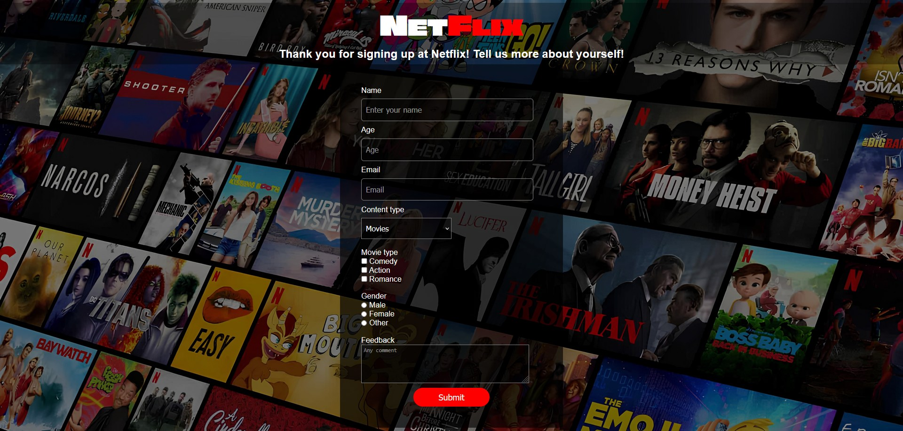

<h1 align="center">Netflix Form</h1>

  <h3>
    <a href="https://fyoqusi.github.io/1IMA-project-hub/Netflix/">
      Lenken til prosjektet
    </a>
  </h3>

<!-- ! Innholdsfortegnelse med lenker-->
<!-- ! # fungerer her på nettsiden-->

## Table of Contents

- [Overview](#overview)
- [Built With](#built-with)
- [Features](#features)
- [How to use](#how-to-use)
- [Contact](#contact)

<!-- ! OVERVIEW -->

## Overview

Replika av Netflix Sign Up Form. Ingen JavaScript, dare design.

## Built With

- [HTML](https://www.w3schools.com/html/)
- [CSS](https://www.w3schools.com/css/default.asp)

## Features

- Ingen (bare visuelt)

## How To Use

Bare se på den

## Contact

- GitHub [Danylo Chernov](https://github.com/Fyoqusi)

## Forventet resultat

## Happy coding!

<!--
En Readme file kan inneholde:
Tittel
Lenken til prosjektet
Table of contents
   Overwiew
   Task Description
   Built with / Teknologier brukt
   API / Getting the API Key
   Features
   How to use
   Project Structure
   Contact
   Resultat
   Linker
   License (This project is licensed under the MIT License.)
   Documentation
   UU / Design
   Dette er fargene jeg brukte
   Ressurser
   Future Plans
   Hva jeg hadde gjort annerledes
osv.
 -->

