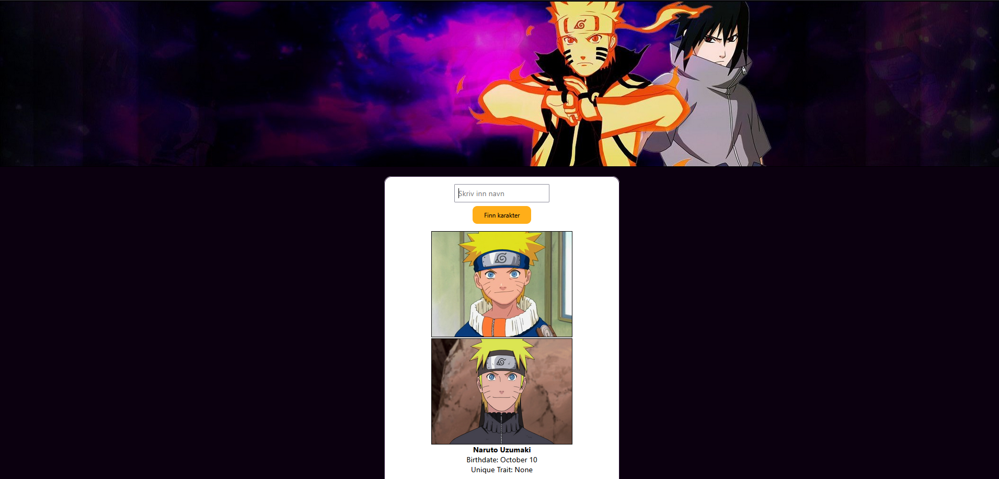

# JS Oppgave: Karaktersøk med API

## Beskrivelse

Dette prosjektet er en nettside hvor brukeren kan søke etter karakterer fra Naruto-universet ved hjelp av et eksternt API. Brukeren skriver inn navnet på en karakter i en input-boks og trykker på en knapp for å hente og vise informasjon om karakteren.

---

## Funksjonalitet

- Inputfelt hvor brukeren kan skrive inn navn på en karakter
- Knapp ("Finn karakter") for å starte søk
- Henter data fra API:  
  https://dattebayo-api.onrender.com/characters

- Viser følgende informasjon:
  - Bilde/bilder av karakteren
  - Navn
  - Fødselsdato
  - Unike egenskaper (Unique Traits)

- Fjerner tidligere søkeresultat ved nytt søk
- Viser kun det nyeste resultatet
- Viser melding dersom ingen karakter blir funnet

---

## Bruk

1. Skriv inn navnet på en karakter i inputfeltet
2. Trykk på **"Finn karakter"**-knappen
3. Resultatet vises på skjermen
4. Søk på nytt for å oppdatere resultatet

---

## Teknologier

- HTML
- CSS
- JavaScript
- REST API (fetch)

---

## Hvordan det fungerer

- Når brukeren trykker på knappen, kjøres en JavaScript-funksjon
- Data hentes fra API-et ved hjelp av `fetch()`
- Resultatet filtreres basert på brukerens input
- Informasjonen vises dynamisk på nettsiden (DOM)
- Tidligere innhold slettes før nytt vises

---

## Eksempel på datastruktur

```javascript
{
  name: "Naruto Uzumaki",
  images: ["image-url"],
  personal: {
    birthdate: "October 10"
  },
  uniqueTraits: ["Jinchuriki", "Sage Mode"]
}
```

## Forventer resultat


