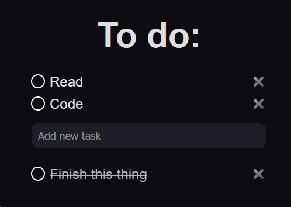

# 📝 To-Do List App

A simple and clean To-Do List application built with **Vanilla JavaScript**, using the **DOM API** and **localStorage** for persistent data storage.



---

## 🚀 Features

- ➕ Add new tasks by pressing **Enter**
- ✅ Mark tasks as completed
- 🔄 Automatically move completed tasks to a separate list
- ❌ Delete tasks
- 💾 Persistent storage using `localStorage`
- ⏱ Tasks are sorted by creation time

---

## 🛠 Technologies Used

- HTML5
- CSS3
- JavaScript (Vanilla JS)
- DOM Manipulation
- localStorage
- JSON (`stringify` / `parse`)

---

## 🧠 How It Works

Each task is stored in `localStorage` as an object:

```js
{
  task: "Example task",
  done: false
}
```

---

## Workflow:

1. A unique key is generated using Date.now()

2. The task object is stored via JSON.stringify()

3. On page load:

- All tasks are retrieved from localStorage

- Parsed using JSON.parse()

- Sorted by timestamp

- Rendered dynamically in the DOM

---

## Adding Tasks

New tasks are added by pressing the Enter key inside the input field.
There is no separate "Add" button — input is fully keyboard-driven.

---

## Project Structure

to-do-list
┣ index.html
┣ style.css
┣ script.js
┣ preview.png
┗ README.md

---

This project was created to practice:

- DOM manipulation
- Working with localStorage
- Handling JSON data
- Building small application architecture
- Managing UI state and persistent data
